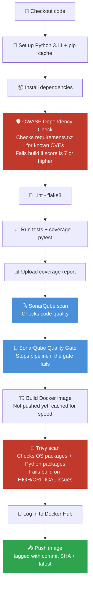
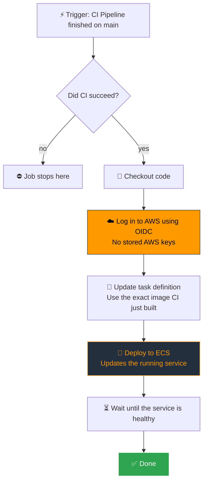
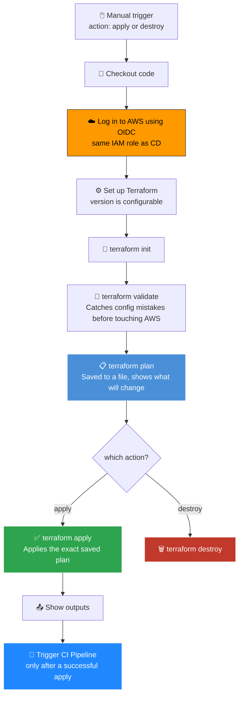

# URL Shortener — A DevSecOps CI/CD Pipeline Project

This is a **DevSecOps project**. The URL shortener app itself is kept simple on purpose. The real focus of this repo is the pipeline — security checks are built into every step, not added at the end.

Every push to `main` runs this flow: **lint → check dependencies for vulnerabilities → run tests → SonarQube quality check → build Docker image → scan the image for vulnerabilities → push image → deploy to AWS ECS with zero downtime.**

---

## App (short version)

A simple URL shortener API — custom short links, expiry, QR codes, bulk shorten, click tracking. Kept simple on purpose (no login, no rate limiting, no analytics tables) so the pipeline stays the main focus, not the app.

| | |
|---|---|
| Backend | FastAPI (Python 3.11) |
| Database | MySQL (SQLAlchemy + PyMySQL) |
| Runs on | AWS ECS Fargate |
| Image registry | Docker Hub |

---

## CI Pipeline



### What each step does

**1. OWASP Dependency-Check**
This runs on `requirements.txt` before anything else. It checks every package against the public vulnerability database (NVD) and stops the build if it finds anything with a CVSS score of 7 or higher. It runs first because it's the fastest check — no point running tests or building an image if a dependency is already known to be unsafe.

**2. Lint + Test**
`flake8` checks code style, then `pytest` with `coverage` runs the actual tests. The coverage report gets uploaded and used later in the SonarQube step, so SonarQube can see real test coverage, not guess at it.

**3. SonarQube**
SonarQube looks at code quality — duplicate code, messy patterns, and security issues in the code itself. If the quality gate fails, the pipeline stops here. This is different from Trivy: SonarQube checks the code you wrote, Trivy checks the packages you installed.

**4. Build the Docker image (don't push yet)**
The image gets built and kept on the runner, not pushed to Docker Hub yet. This matters — nothing unsafe should ever reach a public registry, even for a moment.

**5. Trivy scan**
Trivy checks the finished image — both the base OS packages and every Python package inside it (even ones hidden inside other packages, like the copies bundled inside `setuptools`). If anything HIGH or CRITICAL shows up, the build fails. This is the reason `cryptography`, `fastapi`, and `starlette` are pinned to newer versions in this project — Trivy caught the older versions during development.

**6. Push the image**
Docker Hub login happens only after the scan passes. The image gets two tags — the commit SHA, and `latest`.

---

## CD Pipeline



### What each step does

**Trigger — only runs after CI succeeds**
CD doesn't run on every push directly. It waits for the CI Pipeline to finish, and only continues if CI actually passed (`if: github.event.workflow_run.conclusion == 'success'`). Combined with `branches: [main]`, this means only code that passed every security check in CI can ever get deployed.

**Concurrency control**
```yaml
concurrency:
  group: deploy-production
  cancel-in-progress: false
```
If two CI runs finish close together, their deploys wait in line instead of both trying to update the same ECS service at once.

**AWS login — OIDC, no stored keys**
There's no `AWS_ACCESS_KEY_ID` or `AWS_SECRET_ACCESS_KEY` saved anywhere in this repo. Instead:
1. GitHub creates a short-lived signed token for the workflow run.
2. AWS checks that token against an OIDC identity provider (`token.actions.githubusercontent.com`).
3. An IAM role (`githubIdentityRoleECS`) — locked to this exact repo and branch — gets assumed, and AWS hands out temporary credentials that only work for this one run.

Nothing long-lived sits around waiting to leak. Even if a token got exposed somehow, it expires within the hour and only works for this specific workflow.

**Update the task definition**
The image tag gets swapped to the exact commit CI just built and scanned (`github.event.workflow_run.head_sha`), not `latest`. This makes sure the image that got scanned is the exact one that gets deployed.

**Deploy**
`amazon-ecs-deploy-task-definition` updates the ECS service with the new task definition and waits (`wait-for-service-stability: true`) until the new containers are actually healthy before calling the deploy done.

---

## Infrastructure Pipeline (`infrastructure.yml`)

The AWS infrastructure (ECS cluster, base task definition, networking, IAM) is built with **Terraform** — but it's kept **separate from the push-triggered pipeline on purpose.**

**Why it's manual instead of automatic:** infrastructure doesn't change the same way code does. Code changes with every commit. Infrastructure should only change when someone decides it needs to. Running `terraform apply` on every push would mean touching live cluster and networking resources many times a day for changes that have nothing to do with infrastructure — that's just extra risk for no reason. So this pipeline only runs when someone triggers it manually, and they have to pick `apply` or `destroy` on purpose.



**Plan first, then apply the same plan**
`terraform plan` is saved to a file (`-out=tfplan`), and `apply` uses that exact saved file instead of re-planning. This means there's no gap between what got reviewed and what actually gets applied.

**Same login method as CD**
This pipeline uses the same OIDC + IAM role setup as the CD pipeline — one trust setup for the whole project, not separate credentials to manage for infra and for app deploys.

**Closing the loop**
After a successful `apply`, a second job automatically triggers the CI Pipeline through the GitHub API. So once infrastructure is ready, the build-and-deploy pipeline kicks off right away without anyone needing to trigger it by hand. `destroy` skips this step on purpose — there's nothing to deploy once the infrastructure is gone.

**Keeping infra and app deploys separate**
Terraform manages the base task definition (CPU, memory, execution role, networking), but it's told to ignore changes to the container image going forward:
```hcl
lifecycle {
  ignore_changes = [container_definitions]
}
```
Without this line, every `terraform apply` — even for something unrelated, like a small networking change — would quietly reset the container image back to whatever Terraform's own config says, undoing whatever the CD pipeline deployed most recently. With this line, Terraform and CD each manage their own part of the task definition without stepping on each other.

| | CI/CD (`ci.yml` / `cd.yml`) | Infrastructure (`infrastructure.yml`) |
|---|---|---|
| Runs | Automatically, on every push to `main` | Manually, only when triggered |
| How often | Every commit | Only when infra actually needs to change |
| Manages | App image, ECS service updates | Cluster, networking, IAM, base task definition |
| Risk level | Low — rolling update, easy to reverse | Higher — can touch or destroy live infra, so it needs a person to trigger it |

---

## Security — what this pipeline actually checks

| What | Tool | When it checks | Blocks the build if |
|---|---|---|---|
| Vulnerable dependencies | OWASP Dependency-Check | Before tests run | CVSS score is 7 or higher |
| Code quality issues | SonarQube | After tests | Quality gate fails |
| Vulnerable container image | Trivy | After the image is built | Any HIGH or CRITICAL issue |
| Long-lived AWS credentials | GitHub OIDC + scoped IAM role | Every deploy | Not applicable — there's nothing long-lived to leak |
| Deploying broken code | `workflow_run` + success check | Before CD starts | CI didn't pass |
| Deploy race conditions | `concurrency` group | Every deploy trigger | Overlapping runs just wait their turn |
| Deploying the wrong image | Image tag pinned to commit SHA | Task definition update | Can't happen by design |

---

## Running it locally

```bash
git clone https://github.com/ArshadKhan-007/URL-SHORTENER-CI-CD-ECS.git
cd URL-SHORTENER-CI-CD-ECS
python3 -m venv venv
source venv/bin/activate
pip install -r requirements.txt
cp .env.example .env   # fill in your DB details
uvicorn app.main:app --reload
```

Open `http://localhost:8000/docs` for the interactive API docs.

```bash
# Run tests
coverage run -m pytest tests/ -v --tb=short
coverage report
```

---

## Why this project exists

Most CI/CD portfolio projects stop at "it builds and it deploys." This one goes a step further — it catches unsafe dependencies and images before they ever ship, logs into AWS without storing any long-lived secrets, and keeps infrastructure changes completely separate from app deploys. That's the difference between a CI/CD pipeline and a DevSecOps pipeline.
